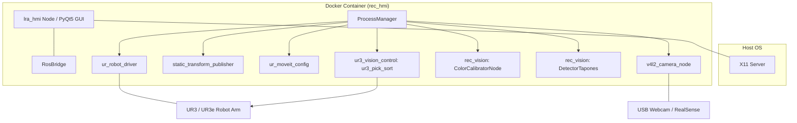

# REC Project: UR3/UR3e Plastic Cap Classification and Robotic Sorting System

## Technical Documentation

**Version:** 1.0.0  
**Date:** 29 May 2026  
**ROS2 Distribution:** Humble Hawksbill (Docker Container Integration)  

---

## Authors and Affiliation

| Author | Affiliation |
|--------|-------------|
| LRA Team | Universidad Politécnica de Madrid (UPM) |

**Correspondence:** `asil.arnous@opendeusto.es`  

**Institution:**  
Universidad Politécnica de Madrid  
Laboratorio de Automática y Robótica (LRA)  
REC Project: Plastic Cap Classification using UR3/UR3e Robotic Arm  

---

## Abstract

This document outlines the **REC Project** codebase, a complete ROS2-based robotic sorting pipeline that classifies and picks plastic bottle caps by color using a UR3/UR3e robotic manipulator. The system integrates computer vision calibration (K-Means clustering on HSV values) and real-time circle detection (Hough Circle Transforms) to project cap positions into 3D robot base coordinates. Operations are managed via a centralized PyQt5 Human-Machine Interface (HMI) dashboard that handles process-group execution, diagnostic pinging, real-time counters, camera visualization, and a software emergency stop (E-Stop). The entire system is dockerized for easy deployment across host operating systems.

---

## Table of Contents

1. [Introduction](#1-introduction)
2. [System Architecture](#2-system-architecture)
3. [Methodology](#3-methodology)
4. [Package Overview](#4-package-overview)
5. [Configuration](#5-configuration)
6. [Docker Launch & Usage Instructions](#6-docker-launch--usage-instructions)

---

## 1. Introduction

### 1.1 Problem Statement
Robotic object-sorting lines typically require the integration of hardware drivers, motion planning scenes, real-time vision algorithms, and calibration routines. Manually launching, tracking, and debugging these processes across multiple terminal windows is error-prone, lacks visual analytics, and presents safety concerns due to the absence of a unified emergency halt switch.

### 1.2 Objectives
*   **O1: Centralized Launch Control:** Group all pipeline nodes into a single launcher managed by a graphical dashboard.
*   **O2: Robust Color Classification:** Automate sorting categorization through HSV K-Means clustering, removing the need for hardcoded threshold values.
*   **O3: Precise Motion Planning:** Utilize MoveIt Inverse Kinematics (IK) to compute joint trajectories for approaching, picking (via suction cup tool), and placing caps.
*   **O4: Streamlined Containerized Deployment:** Deliver the full ROS2 stack, drivers, UI library, and environment config via a Docker container.

---

## 2. System Architecture

The project consists of three main blocks: the **HMI Dashboard**, the **Vision System**, and the **Robot Sequencer**. These blocks run as separate ROS2 nodes communicating over a shared network:



---

## 3. Methodology

The sorting operation follows a sequential pipeline:

1.  **Container Spin-up & Build:** The workspace build is executed automatically on startup inside the Docker container via [entrypoint.sh](file:///home/asil/Desktop/Clasificaci-n-de-tapones-plasticos-REC-/LRA_ws/entrypoint.sh).
2.  **Color Calibration:** A sample set of HSV features is collected from cap detections to define sorting box color centroids using OpenCV K-Means clustering.
3.  **Active Detection:** The camera feed detects circular caps using Hough Transforms, classifies their color by comparing Euclidean distance to centroids, projects their pixel coordinates to physical 3D space, and publishes target coordinate points.
4.  **Pick-and-Place Sequencer:** The manipulator node listens to targets, queries MoveIt IK for joint trajectories, commands the robot, and toggles pneumatic suction via UR tool IO services.

---

## 4. Package Overview

The workspace under [LRA_ws](file:///home/asil/Desktop/Clasificaci-n-de-tapones-plasticos-REC-/LRA_ws) contains four custom ROS2 packages in the [src/](file:///home/asil/Desktop/Clasificaci-n-de-tapones-plasticos-REC-/LRA_ws/src) folder:

1.  **[lra_hmi](file:///home/asil/Desktop/Clasificaci-n-de-tapones-plasticos-REC-/LRA_ws/src/lra_hmi):** Central dashboard containing the PyQt5 user interface. Controls subprocess lifecycles and manages emergency shutdowns. See [lra_hmi README](file:///home/asil/Desktop/Clasificaci-n-de-tapones-plasticos-REC-/LRA_ws/src/lra_hmi/README.md) for details.
2.  **[rec_vision](file:///home/asil/Desktop/Clasificaci-n-de-tapones-plasticos-REC-/LRA_ws/src/rec_vision):** Computer vision package for calibration and real-time cap classification. See [rec_vision README](file:///home/asil/Desktop/Clasificaci-n-de-tapones-plasticos-REC-/LRA_ws/src/rec_vision/README.md) for details.
3.  **[ur3_vision_control](file:///home/asil/Desktop/Clasificaci-n-de-tapones-plasticos-REC-/LRA_ws/src/ur3_vision_control/ur3_vision_control):** Motion planning and sequence controller that interfaces with MoveIt and UR hardware IO interfaces. See [ur3_vision_control README](file:///home/asil/Desktop/Clasificaci-n-de-tapones-plasticos-REC-/LRA_ws/src/ur3_vision_control/ur3_vision_control/README.md) for details.
4.  **[lra_vision](file:///home/asil/Desktop/Clasificaci-n-de-tapones-plasticos-REC-/LRA_ws/src/lra_vision):** Camera wrapper, URDF models, TF broadcasters, and calibration routines. See [lra_vision README](file:///home/asil/Desktop/Clasificaci-n-de-tapones-plasticos-REC-/LRA_ws/src/lra_vision/readme.md) for details.

---

## 5. Configuration

All system configurations, parameters, camera frame rates, and robot IP definitions are declared centrally in [default_config.yaml](file:///home/asil/Desktop/Clasificaci-n-de-tapones-plasticos-REC-/LRA_ws/src/lra_hmi/lra_hmi/config/default_config.yaml). The processes launched via the HMI dynamically reference these values.

---

## 6. Docker Launch & Usage Instructions

### 6.1 Prerequisites
*   **Docker** & **Docker Compose** installed on your host system.
*   An active **X11 Server** running on the host (for GUI window forwarding).
*   Ethernet connection configured if connecting to a physical UR3/UR3e robot (Default IP: `169.254.12.28`).

### 6.2 Host Setup for GUI Display (X11 Forwarding)
Before starting the container, permit the container to connect to your host's local X11 display:
```bash
xhost +local:docker
```

### 6.3 Build and Launch the Stack
Navigate to the workspace directory and start the services using Docker Compose:
```bash
cd LRA_ws
docker compose build
docker compose up
```

> [!TIP]
> The container builds the workspace packages using `colcon` on startup. To speed up subsequent starts, set `REC_INCREMENTAL=1` as an environment variable to skip cleaning directories:

```bash
REC_INCREMENTAL=1 docker compose up
```

### 6.4 Offline Simulation Mode (Without physical hardware)
To test the HMI interface and simulate behavior without connecting to a physical camera or robot, launch the container with the `LRA_HMI_SIM` variable enabled:
```bash
LRA_HMI_SIM=1 docker compose up
```
In simulation mode:
*   ICMP pings are forwarded to `127.0.0.1`.
*   Mock launch scripts are loaded instead of requesting hardware interfaces.
